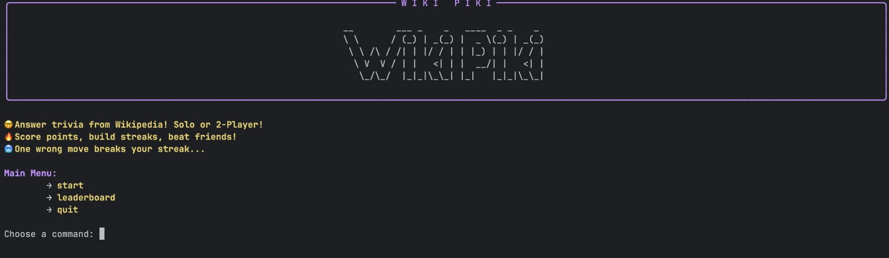
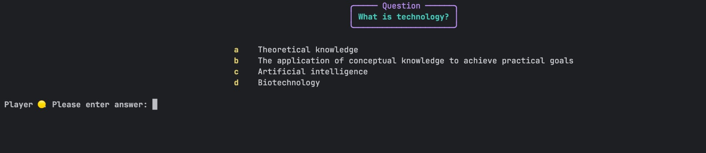
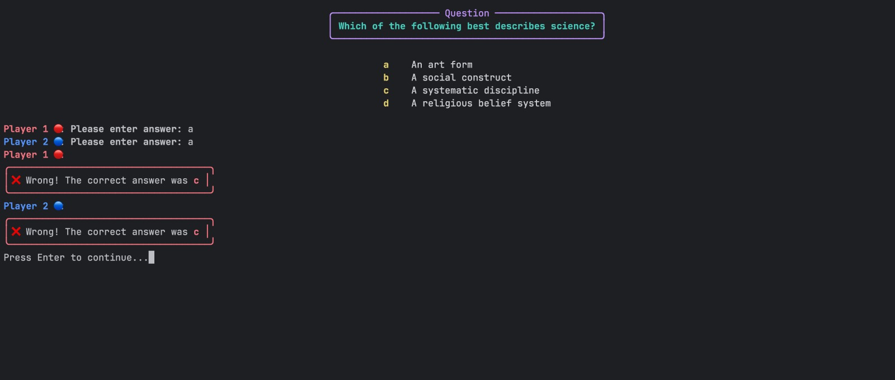
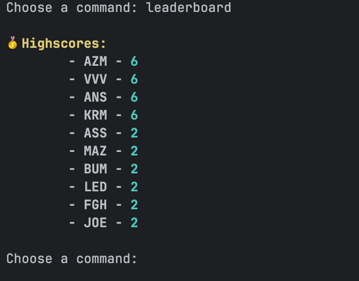

# WikiPiki

A terminal trivia and quiz game built in Python that pulls facts from Wikipedia and tracks high scores. Answer randomly generated questions, rack up points, and challenge your knowledge in a fun, interactive CLI!

## Features

- **Wikipedia-powered quizzes:** Unique questions generated from real Wikipedia facts.
- **CLI Game:** Play entirely in your terminal—fast and distraction-free.
- **Command-based gameplay:** Enter different commands to start, view scores, get help, and more.
- **High score tracking:** Records your points and compares them to previous top scores (`highscores.json`).
- **Multiple question types:** Supports facts, multiple choice, and more with randomization.
- **ASCII Art banners:** Adds a bit of fun and polish to your experience.

## How to Play

1. **Clone the repository:**
```bash
git clone https://github.com/Miami05/WikiPiki.git
```
```bash
cd WikiPiki
```

2. **Run the main game:**
```bash
python main.py
```
3. **Choose a command** from the menu to start a quiz, view high scores, or learn how to play!

## Example Commands

- **start** — Starts a new trivia session
- **scores** — View high scores
- **help** — Show available commands and instructions
- **quit** — Exit the application

## Project Structure

WikiPiki/  
├── main.py # Game entrypoint (CLI)  
├── questions_generator.py # Wikipedia-powered question generation  
├── ascii_art.py # Banners & stylized text  
├── highscores.py / highscores.json # Score management  
├── utils.py # Helper functions & command dispatch  
├── wikipedia_client.py # Wikipedia integration  
└── ... # Other files and modules

## Screenshots

### Main Menu


### Gameplay


### Two-Player Mode


### Leaderboard



## Customization & Extensions

- Add question types or expand Wikipedia data usage in `questions_generator.py`.
- Improve scoring system or add user authentication.
- Style your CLI with even more ASCII art in `ascii_art.py`.

## License

MIT

## Author
Mohamad Azzam
Muhammed Azeem
Dmitri Kuli
Ledio Durmishaj
Aviv Avidan
Manish Bilgaye

Challenge yourself and your friends WikiPiki makes learning fun and competitive!
